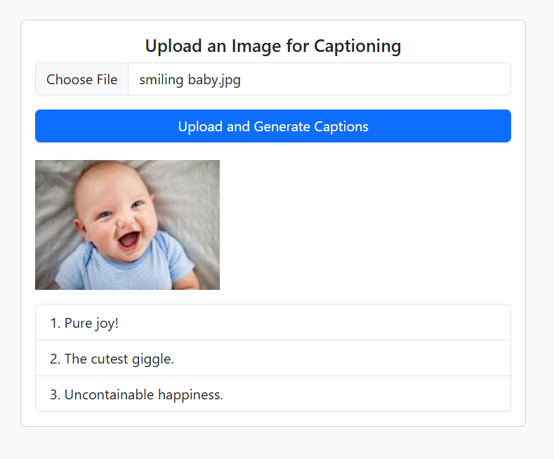

# 🖼️ AutoCaption

This is a full-stack application that allows users to upload an image via a web UI. The image is sent to a Spring Boot backend, which uses **Spring AI** integrated with **Ollama's Gemma3:4b multimodal model** to generate **three descriptive captions** for the image.

---

## ✨ Features

- Upload image through a user-friendly web interface
- Generate **three unique captions** using LLM vision capabilities
- Display captions in a clean, responsive UI
- Powered by `Ollama` running `gemma3:4b` multimodal locally
- Backend built with **Spring Boot 3** and **Spring AI**
- In-Memory caching available - Get quick responses for previously uploaded images
- JWT Authentication secured REST End points
- CORS handling to adhere to best security practices
- Configurable API Rate Limiting available to choose from Fixed Window, Sliding Window & Token Bucket Rate Limiting Algorithms
- Redis backed API rate limiting with configurable Redis connections to remote instances

---

## 🚀 Getting Started

### 1. Prerequisites

- Angular 17+
- Java 17+
- Maven
- [Ollama](https://ollama.com/) installed and running locally
- Gemma3:4b model pulled locally

```bash
ollama pull gemma3:4b
```

---

### 2. Backend Setup

📁 application.properties

- spring.ai.ollama.chat.options.model=gemma3:4b

- spring.servlet.multipart.max-file-size=10MB (optional)
- spring.servlet.multipart.max-request-size=10MB (optional)

📦 Install Dependencies & Run

```bash
cd service-autocaption
mvn clean install
mvn spring-boot:run
```

Backend API is available at: http://localhost:8080/api/images/generateCaption

---

### 3. Frontend Setup


```bash
cd autocaption-ui
npm install
npm start
```

The UI should now be available at: http://localhost:4200

---

## 🧠 How It Works

- User uploads an image via the web form.
- Image is sent as multipart/form-data to the /api/images/captions endpoint.
- Spring Boot prompts the Gemma:4b LLM model to generate captions for the image using the Ollama ChatClient.
- The LLM generates 3 captions which are returned as a JSON array.
- The frontend displays the captions neatly.

---

## 🧪 Testing the API
Use curl:

```bash
curl -X POST http://localhost:8080/api/images/upload \
  -H "Content-Type: multipart/form-data" \
  -H "Authorization: Bearer <access-token>" \
  -F "image=@/path/to/image.jpg"
```

---

## 📸 Sample Output



---

## 📉 Limitations


- Local Model Only: Relies on the gemma3:4b model running via Ollama locally — no remote or cloud support by default. Though, it can be easily tweaked to used any proprietary AI service provider.

- Performance: Large images may take longer to process or might need downscaling for performance.

- Caption Quality: Caption accuracy depends on the model’s capabilities. Some outputs might be vague or repetitive.

- Single Image: Currently supports uploading one image at a time.

---

## 🚀 Future Improvements
- ✅ Add drag-and-drop and image preview enhancements in the UI

- ✅ Support multiple image uploads

- ✅ Downscale large images before processing

- ✅ Switch between models (e.g., llava, llava-phi, bakllava) from UI or backend

- ✅ Add Docker support to make deployment easier

- ✅ Add OpenAPI (Swagger) documentation for backend

---

## 📝 License
This project is open-source and free to use for personal or academic purposes.